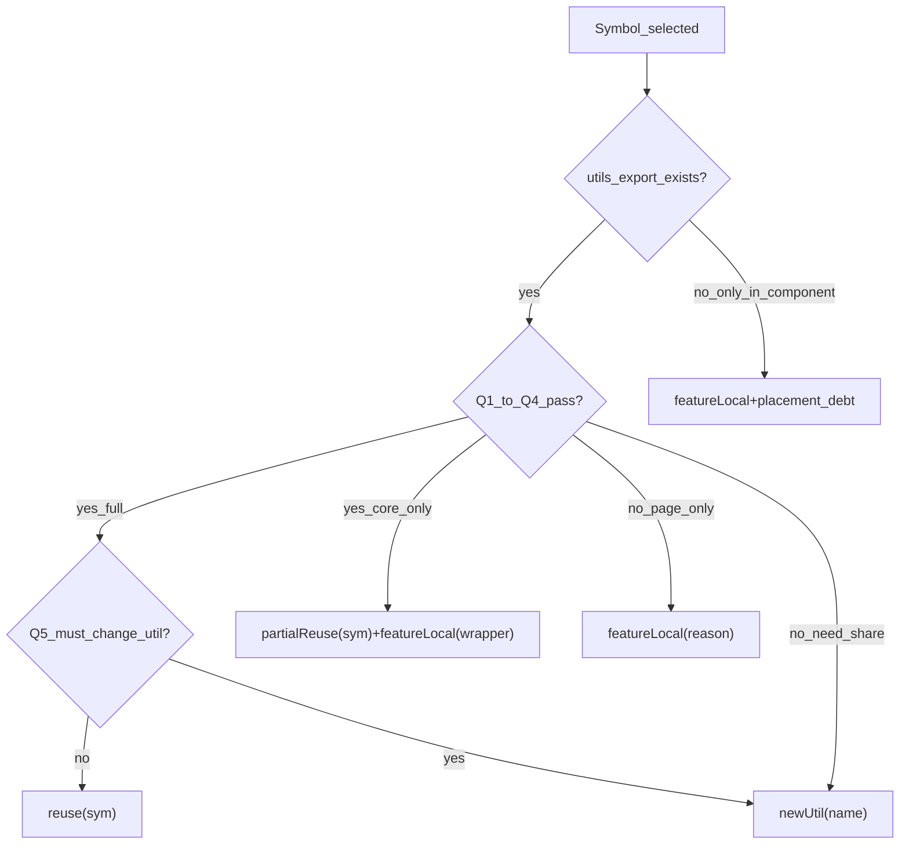

# Utils 按需复用 — Identify → Confirm（五问）→ Verdict

> 配套：项目 `AGENTS.md` utils 复用节、[`.cursor/skills/reuse-before-create/SKILL.md`](../../.cursor/skills/reuse-before-create/SKILL.md)、[`.cursor/rules/utils-reuse-gate.mdc`](../../.cursor/rules/utils-reuse-gate.mdc)

**范围**：仅公共 **utils 目录**（默认 `src/utils/`）。hooks / components / feature 不在 utils-book Shortlist；可 **featureLocal** 自写。组件复用不替代 utils **reuse**。

**Confirm+Verdict 不可跳过**：对每个将 import/调用的 util，Write 前必须在 **对话** 完成 **Confirm（五问）+ Verdict（最终）**。**已有 import / WIP 接线 / 无新 import 均不豁免**。**Discovery（§2）** 在门禁适用或拟写 feature 本地 helper 时 **必做**。

---

## 0. 复用原则（默认宽松）

1. **已实现勿重写** — 同语义、同存储/API 契约的逻辑，禁止在 feature 再抄 regex/DOM/序列化。
2. **子集 / 单函数 import** — 类或文件里有很多 export，只 `import` 并调用需要的一个即可。
3. **仅五问硬失败或 Q5=是** 才 **newUtil** / **featureLocal**；展示层用词、类体积、怕依赖 **不能** 单独否决 reuse。
4. **有疑虑但无真不一致** → **偏向 reuse**，禁止 duplicate implementation。

**No extend**：Q5=是 时 → **newUtil** 新符号；**不是**「有一点差异就不 import」。

---

## 1. 可复用证明（架构师标准）

> **在不动已有 export 签名与默认语义的前提下，用该 util 替换 feature 里拟新写的同语义逻辑，业务契约与风险均可接受。**

- 仅凭工具书摘要 → **不构成证明**（只能 Shortlist）。
- 必须 **Read** 将调用的 **export/方法** 在 **utils 源文件**（`utilsDir` / `@/utils` 路径）中的实现；可 partial Read 或在该 util 文件内 Grep。**仅** Read/Grep 其他 feature 里的 import/调用 **不能** 替代 Read util 源码。读整文件非必须（子集/单 export 即可）。

### 1.1 Confirm 五问

| # | 问题 | 通过标准 |
|---|------|----------|
| **Q1 输入契约** | 类型、必填/可选、空值/非法值语义是否与调用方一致？ | 一致 → 继续；硬失败 → newUtil / featureLocal |
| **Q2 输出与存储/API** | 返回值形状、持久化串、发给后端的字段含义是否一致？ | **不含** UI 芯片文案、i18n、按钮/标签等**展示层**用词 |
| **Q3 副作用** | 是否引入不可接受的 DOM / storage / API / 全局状态？ | 无或调用方可接受 |
| **Q4 替换实验** | 在典型 + 边界输入上，`util(x)` 是否 ≡ 拟写的 `f(x)`？ | 等价或可接受差异（须写明）；展示层差异在 Confirm 中单列，**alone 不判 newUtil** |
| **Q5 须改 util 内部？** | 是否只有改已有 export 签名/默认语义/实现才能满足？ | **是** → **newUtil**；**否** → 倾向 **reuse** |

**充分结论**：Q1–Q4 通过且 Q5=否 → **Verdict: reuse**。

### 1.2 无效 reject 理由（不得单独否决 reuse）

| 误判 | 判定 |
|------|------|
| 展示层 / 可读文案不同 | 不计入 Q2 硬失败 → **reuse** 或 **§1.5 问用户** |
| 类里还有很多别的 export | 只调一个 → **reuse** |
| 需求是已有能力的子集 | **reuse** 子集 API |
| util 更大、未走到的分支 | 不算污染 |
| 「组件要瘦」 | 编排 featureLocal；纯函数转换仍走五问 |

**禁止**：因展示层细小差异 **alone** 否决 reuse 并复制实现 — 应 **reuse** 或 **问用户**（§1.5），禁止静默 fork。

### 1.3 不能证明 reuse

| 类型 | 五问 | Verdict |
|------|------|---------|
| **A. 真不一致** | Q1–Q4 硬失败（如入参模型不同、输出协议不同） | 要共享 → **newUtil**；仅本页 → **featureLocal** |
| **B. 必须 extend** | Q5=是 | **newUtil** 新符号 |
| **无 export** | Q4 无 reuse 对象 | **newUtil** 或暂 **featureLocal 一份** |

### 1.4 Verdict 与 No extend

| Verdict | 条件 |
|---------|------|
| **reuse(sym)** | 五问通过 + Q5=否；`import`；不改已有 export |
| **partialReuse(sym) + featureLocal(wrapper)** | util 覆盖核心；页面包装 |
| **newUtil(name)** | A 或 B；`pnpm gen:utils-book`；每个新 export 上方 **`/** */`** |
| **featureLocal(reason)** | A 且仅本页；或强绑 UI/state |
| **featureLocal + placement debt** | 组件内逻辑；跨 feature 复制 — 须写 debt 与收敛候选 |

### 1.5 细小差异 — 向用户确认

当 **Q1–Q4 通过（逻辑可 reuse）、Q5=否**，但存在**用户可见**的展示层差异（文案、标签、占位符用词等），且任务/规范**未写明**要哪种：

- **Write 前** 向用户确认（`AskQuestion` 或结构化二选一）。
- **禁止**静默在 feature 自写一套；**禁止**未告知就改已有 export（No extend）。

**提问须包含**：

| 要素 | 说明 |
|------|------|
| **差异点** | 一句话说明展示层哪里不同 |
| **选项 A — reuse** | 符号名 + **Read 源码后的实际行为**（现有 util 真实输出/展示） |
| **选项 B — 产品定制** | 选 B 时：Verdict 为 featureLocal 包装或 **newUtil**；**不得** extend 旧 export |
| **推荐** | 逻辑已对齐时推荐 A，并说明 B 的维护成本 |

**可不问**：需求已指定文案；或差异对用户不可见且任务不关心。

用户选 A → **reuse**；选 B → **featureLocal** 或 **newUtil**。

### 1.6 选中后判断树（post-selection proof）

> **重心**：Identify 出 util 或拟写/保留的本地 helper 之后，**每个符号**须 Read 源码（或组件参照）并 **分项 Q1–Q5**，再落 Verdict。Discovery（§2）是 Shortlist 前置，**不能替代**本节的证明。

**Step 0 — 候选在哪？**

| 候选来源 | Read 要求 | Q4 的 reuse 对象 |
|----------|-----------|------------------|
| `utilsDir` export | Read **util 源文件** export | 该 export |
| 仅在 feature 组件内（未 export） | Read 组件实现 + **Grep utilsDir** 语义等价 | utils **export**（若无 → 无 reuse 对象） |
| 拟写/保留的 featureLocal helper | Grep utilsDir + 同文件 sibling | 最近似 util export 或 `—` |

**Step 1 — 五问（每个符号一组，Q1–Q4 分项必写）**

- **禁止**「Q1–Q5 通过」「五问通过」等空泛结论（Hook v0.2.1 会 deny）。
- util 与 **Local helpers 表每一行** 均须有自己的 Q1–Q5（可压缩句式）。

**Step 2 — Verdict 阶梯（五类）**



| Verdict | 何时 | 动作 |
|---------|------|------|
| **reuse(sym)** | Q1–Q4 通过且 Q5=否 | 直接 `import` / 调用 |
| **partialReuse(sym) + featureLocal(wrapper)** | util 覆盖核心逻辑；页面要包装类型 / ElMessage / 业务字段 | util 做转换；包装留 feature |
| **newUtil(name)** | Q1–Q4 硬失败但要跨 feature 共享；或 Q5=是 | 新 export + JSDoc + `pnpm gen:utils-book` |
| **featureLocal(reason)** | 仅本页；强绑 UI / state / DOM 编排 | 不写 utils |
| **featureLocal + placement debt(ref → candidate)** | 逻辑仅在组件内；跨 feature 复制 | Message A 写 debt 与收敛方向（`newUtil` / `composable`） |

**组件内候选（无 export）专用**：

- utils **无**语义等价 export → **不能**写 `reuse`；Q4 须写明「无可 import 的 reuse 对象」。
- 纯函数跨 feature 复制（如 `replaceMentionUrlInPrompt`）→ **featureLocal + placement debt → 候选 newUtil**。
- DOM / Selection 编排（`checkMention`、`insertMentionForRef`、cursor 保存/恢复）→ **featureLocal + placement debt → 候选 composable**（通常不是 newUtil）。

**文件中已存在、本次仍依赖的 helper**（如 `validateFile`）须在 Local helpers 表与 Confirm 中 **一并重走**，不因「上次就有」而跳过。

---

## 2. Discovery（必做 — 触发时）

**触发**（满足任一）：

- 门禁适用（现有 `@/utils`、语义任务 mention/upload/validate 等、将 import utils）
- 拟在 feature **新增/改写** 纯函数 helper（FileReader、dataUrl、validate、convert、base64、mime 等）

**动作**（二选一，Confirm 阶段须写明）：

| 代号 | 动作 |
|------|------|
| **D1** | **首选** `agent-utils-reuse search "<任务关键词>" --limit 8`；**备选** `Grep` [`utils-index.json`](utils-index.json)（按符号名/摘要关键词）。列出候选 `name @ path` |
| **D2** | `Grep` / `SemanticSearch` **`utilsDir`**（关键词来自计划 helper 语义，如 `base64`、`dataUrl`、`validateFile`） |

**Agent 禁止（Shortlist）**：Read `utils-book/index.md`、Read `utils-book/{章}.md`、Grep 整个 `utils-book/` — Markdown 仅供人类浏览（v0.3.0）。

**Hook（v0.3.0 confirm；仅 `hookMode: confirm` 时生效）**：Write 到 `remindWritePaths` 且补丁 **新增本地 function/helper** 时，本会话须已有 D1 或 D2 证据。

**禁止**：仅凭摘要写 **Verdict: reuse**。同名见 `utils-index.json` 的 `ambiguous` 或 utils-book 附录（人类查阅）。

**从其他 feature 组件复制纯函数前**：须 D1/D2；逻辑仅在组件内、utils 无 export → 可 **featureLocal**，Message A 标注 **placement debt**（建议 composable）。

---

## 3. Write 前对话输出（Confirm 阶段 — 必做格式；可与 Implement 同轮）

**在对话中输出**（不要写入 cache JSON 文件）。**必做**：**每个 util + Local helpers 表每一行** 各有一组 **分项 Q1–Q5** + 行级 Verdict。**禁止**空泛「Q1–Q5 通过」（Hook v0.2.1 deny）。

**Identify（识别，必做）**：列出本任务将 import/调用的 util + 拟写/保留的 feature helper（含文件中已有、本次仍依赖者）。

**Discovery（触发时必写）**：`D1: search "数组 排序"` 或 `D1: Grep path:docs/agent-catalog/utils-index.json "sortAsc"` | `D2: Grep path:src/utils "base64|dataUrl"`（相对项目根；绝对路径 v0.3.5+ 亦识别）

**Local helpers（拟写或保留 — 每个 helper 至少一行；Hook 检测表头 + 至少一行数据）**

推荐表头：**`Local helpers`** 或 **`| 本地函数 |`**；**`| Helper |`** 亦接受（v0.3.5+）。

| 本地函数 | utils / 组件候选 | 对照结论 |
|----------|------------------|----------|
| readFileAsDataUrl | fileToBase64 @ imageUploadUtils.ts | reuse(fileToBase64) |
| dataUrlToRefItem | dataUrlToImageFile @ cropExport.ts | partialReuse(dataUrlToImageFile) + featureLocal(wrapper) |
| validateFile | validateFileType + validateFileSize | featureLocal 薄包装 |
| htmlToText | ai-promptInput（未 export）；Grep utils 无 | featureLocal + placement debt → mentionHtmlToText |
| replaceMentionUrlInPrompt | ai-videoUpload 同模式 | featureLocal + placement debt → replaceMentionTagUrlInText |
| checkMention 等 | ai-promptInput（未 export） | featureLocal + placement debt → useMentionEditor |

无 utils 候选时写 `—` 并说明 Grep 范围。**D1 零候选时必须先 D2**（Grep `utilsDir`），禁止直接 featureLocal 重复 util 语义。

**Gate N/A**（纯 UI / 无 utils / 无 local helper）：Confirm 阶段写 **`Gate N/A: <理由>`**。

**Sibling check（必做）**：Read export X @ util 文件后 → Grep **同一 util 文件** 内相关 export，再写 local helper。

**Confirm（五问）— 每个符号一组（示例：fileToBase64）**

- Q1 输入：`File` → 与拟写 `readFileAsDataUrl` 一致
- Q2 输出：`Promise<string>` data URL — 一致
- Q3 副作用：FileReader only — 可接受
- Q4 替换实验：`fileToBase64(file)` ≡ `readFileAsDataUrl(file)`（同 readAsDataURL）
- Q5 须改 util 内部？否

**Verdict（最终）**（每行一个）：

- reuse(`fileToBase64`)
- partialReuse(`dataUrlToImageFile`) + featureLocal(`dataUrlToRefItem`)
- featureLocal(`validateFile`) — 10MB / 扩展名 / ElMessage 包装
- featureLocal(`htmlToText`) + placement debt(ai-promptInput → 候选 mentionHtmlToText @ utils/prompt)

**用户确认（仅当 §1.5 适用）**：差异点 + 选项 A/B + 用户选择。

**Golden Message A（复盘 @/upload 冒烟 — 勿照抄 Verdict，须 Read 后自主 Confirm）**

```markdown
**Identify**：fileToBase64, uploadSingleFile, PromptUtils @ utils；本地 htmlToText, replaceMentionUrlInPrompt, checkMention…

**Discovery**：D1 utils-book index + chatFile

**Local helpers**
| 本地函数 | utils / 组件候选 | 对照结论 |
| htmlToText | ai-promptInput；utils 无 HTML 层 | featureLocal + placement debt |
| replaceMentionUrlInPrompt | ai-videoUpload 同 regex | featureLocal + placement debt → newUtil 候选 |

**Confirm — fileToBase64**
- Q1 … Q4 … Q5 否
**Confirm — htmlToText**
- Q1 … Q4 无可 import reuse 对象 … Q5 否

**Verdict（最终）**：reuse(`fileToBase64`)；featureLocal(`htmlToText`) + placement debt(…)
```

---

## 4. 最终 Verdict（五类）

| Verdict | 条件 | 动作 |
|---------|------|------|
| **reuse(sym)** | Q1–Q4 通过 + Q5=否（含用户选 A） | `import` |
| **partialReuse(sym) + featureLocal(wrapper)** | util 覆盖核心；页面包装类型/消息/字段 | util + 薄包装 |
| **newUtil(name)** | A/B；或无 export 要共享 | 新符号 + **`/** */`** + `pnpm gen:utils-book` |
| **featureLocal(reason)** | A 且仅本页；或强绑 UI/state | 不写 utils |
| **featureLocal + placement debt** | 组件内逻辑跨 feature 复制 | debt 行写收敛候选；本次可仍 featureLocal |

---

## 5. 范式示例（非穷尽，不替代五问）

> 以下仅帮助理解五问；**每个任务**仍须 Read 源码并自主 Confirm，不得照抄 Verdict。

| 模式 | Confirm 要点 | 典型 Verdict |
|------|--------------|--------------|
| 时间/字符串格式化，IO 一致 | Q1–Q4 通过 | **reuse** |
| validate 类但入参模型不符（如要 File、需求要字段规则） | Q1/Q4 硬失败 | **featureLocal** |
| 同名相近但实现要不同输入 | Q1/Q4 硬失败 | 禁止误 **reuse** |
| 无合适 export、需跨处共享 | — | **newUtil** |
| 逻辑可 reuse、仅展示层用词不同且需求未写明 | Q1–Q4 过；§1.5 | **问用户** 后 reuse 或 featureLocal/newUtil |
| `readFileAsDataUrl` vs `fileToBase64` | Q4 等价 | **reuse** |
| `dataUrlToRefItem` vs `dataUrlToImageFile` | util 做 dataURL→File | **部分 reuse** + featureLocal 包装 |
| `validateFile` vs `validateFileType+Size` | 10MB/文案/扩展名兜底 | **featureLocal 薄包装** 或 reuse+§1.5；禁止整段重写 |
| `textToHtml`「参考图N」vs `convertAllTagsToHtml`「图片N」 | 展示层 | **§1.5 问用户** 或 **newUtil(imageNamer)**；禁止 silent regex fork |
| 从 `ai-promptInput` 抄 `htmlToText` 等 | utils 无 export | **featureLocal** + Discovery + **placement debt** |
| `replaceMentionUrlInPrompt` / `removeMentionsForRefUrl` | ai-videoUpload 同模式；utils 无 export | **featureLocal + placement debt → newUtil** |
| `checkMention` / cursor DOM 编排 | ai-promptInput 未 export | **featureLocal + placement debt → composable** |
| `textToHtml` / `buildMentionContext` | PromptUtils 薄映射 | **featureLocal 胶水** 或 reuse 包装 |

---

## 6. 反模式

| 反模式 | 正确做法 |
|--------|----------|
| feature 重复实现 utils 已有语义的纯函数 | **reuse** 或 **newUtil**（无 export） |
| 未 Discovery 就写 util 语义本地 helper | 先 D1/D2 + Local helpers 表 |
| 同文件 sibling export 已存在却整段重写 | Grep 同 util 文件 + reuse 或薄包装 |
| 从组件抄纯函数未 Grep utils | D1/D2；标注 placement debt |
| 仅读摘要就 reject/reuse | Read 源码 + 五问 |
| 以展示层/子集/类体积/瘦组件 alone 否决 reuse | 五问；或 **问用户** |
| 展示层差异时静默 fork | **reuse** 或 **§1.5 问用户** |
| 必须改 util 内部才能用 | **newUtil**，No extend |
| 写 `.utils-discovery-cache.json` 等 cache 文件 | **对话**输出 D/C/V；软门禁无 cache 环节 |
| newUtil 但 export 无 `/** */` 或 utils-book 未 regen | 补 JSDoc + `pnpm gen:utils-book` |
| 空泛「Q1–Q5 通过」无分项 | 每个符号分项 Q1–Q4 + Q5 |
| 跨 feature 复制未写 placement debt | Message A debt 行 + 收敛候选 |
| 文件已有 helper 未重 Confirm | Local helpers 表含保留行 + 五问 |

---

## 7. 验收 prompt（人工 / Agent 冒烟）

1. 时间类 util → 分项五问 → **reuse**
2. validate 入参不符 → **featureLocal**
3. 无 export、需共享 → **newUtil** + regen
4. 摘要像、实现要不同 IO → 禁止误 **reuse**
5. 改 utils 前无 Identify+分项五问 → Hook deny（v0.2.1）
6. 任意新需求：**不得**从规范抄 Verdict；展示层未写明时须 **问用户** 或 reuse
7. Agent 不得 Write gate cache JSON 文件
8. 实现 `@`/upload：Message A 含 Discovery + Local helpers + 同文件 sibling
9. 无 Discovery 直接 Write 新 `function readFileAsDataUrl` → Hook deny（v0.2.0）
10. Read index 后再 Write 本地 helper → 仍须 Message A（分项五问 + Local helpers 表 + Verdict）
11. 空泛 `Q1-Q5 通过` 无 Q1–Q4 分项 → Hook deny Verdict
12. Discovery OK 但 Message A 无 Local helpers 表 → Hook deny（新增 helper）
13. `htmlToText` 从 ai-promptInput 复制 → Verdict 含 **placement debt**
14. `dataUrlToRefItem` → **partialReuse** + featureLocal 包装，非整段重写
