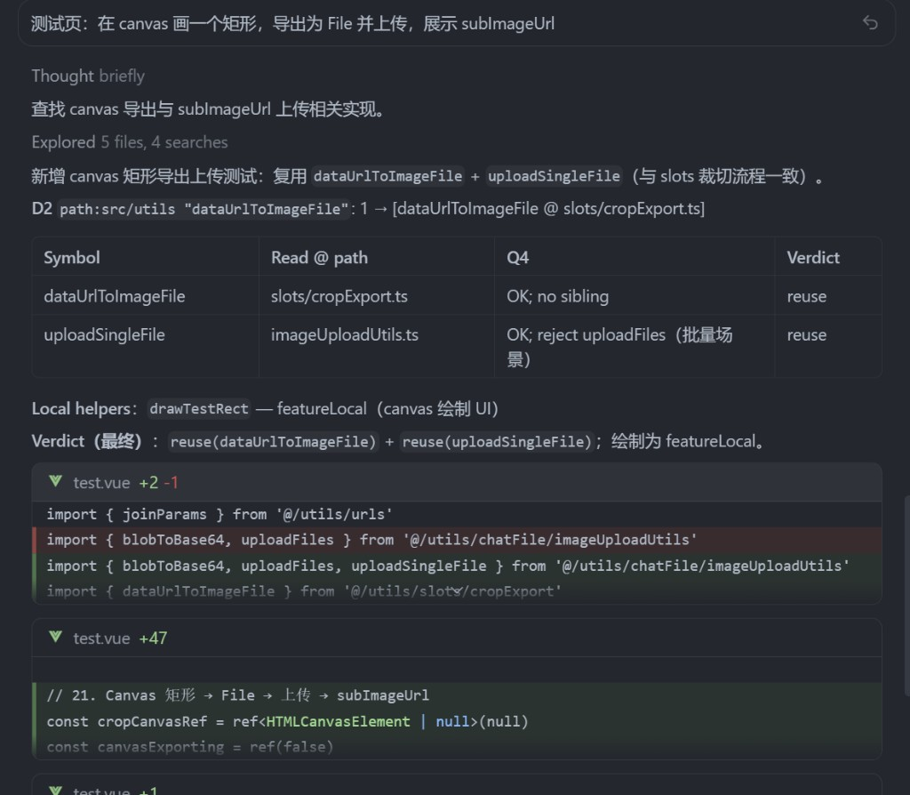
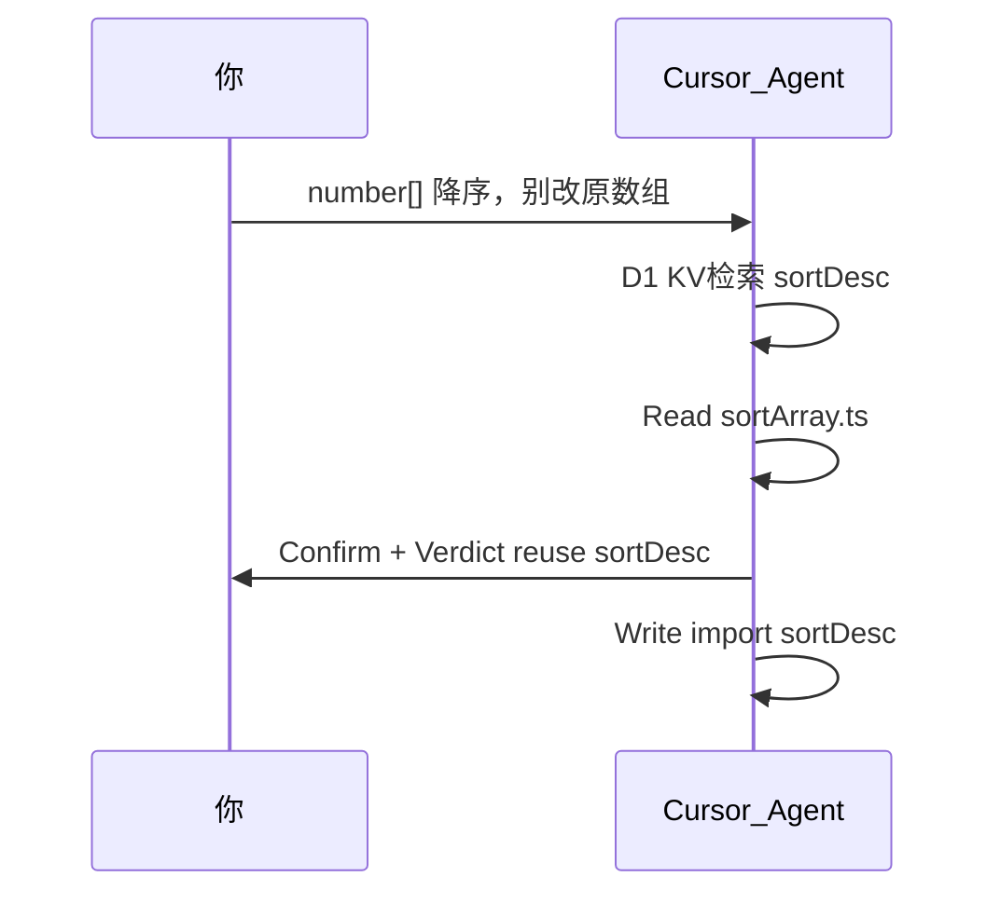

# 🤖 AI 写代码总在重复造轮子？我们把 Utils 复用门禁做进了 Agent 运行时（已开源）

---

让 Cursor / Claude Code 一类 Agent 在前端项目里实现功能，你大概率遇到过这种场面：

任务描述很清晰，Agent 也很「勤快」——Read 了几个文件，然后开始 Write。等 diff 出来一看：**业务目录里又多了一套和公共 `utils` 几乎一样的 regex / DOM 解析 / 序列化逻辑**。

更气人的是，它往往**读过**工具目录，甚至搜到过某个 `xxxUtils.ts`，最后却用「展示文案不一样」「组件要瘦」「这个文件里还有很多别的 export」之类的理由，**静默 fork** 了一份实现——你 Review 的时候那种「这玩意儿 utils 里不是有吗？」的既视感，懂的都懂。

---

前段时间 Cursor 帮我改一个列表页。它先 Read 了整个 `src/utils`，我心想：这次应该会复用了吧。

结果几秒钟后，它还是在业务目录里写了一份几乎一样的降序排序函数。更离谱的是，它**读过** `sortArray.ts` 里的 `sortDesc`。

那一刻我意识到：问题往往不是 Agent **找不到**，而是它从来没有在 chat 里**证明「为什么不用已有 util」**——Read 了，不等于判过了；搜到了，也不等于可以 reuse。

作为长期用 AI 写业务的前端，我的体会是：模型会不会写代码是一回事，**它能不能先证明「现有 util 能接」再动手**，对维护成本影响更大。重复实现分叉起来，修 bug 真的修两遍（别问我怎么知道的）。

这套方案已开源：**[agent-utils-reuse](https://github.com/qianfan-cmd/agent-utils-reuse)**。下文讲**我为什么**这样设计；急着试用的可直接跳 [§九、快速上手](#九快速上手)。

文中主线例子只用 `sortAsc` / `sortDesc` / `sortArray.ts`（来自 [examples/minimal](https://github.com/qianfan-cmd/agent-utils-reuse/tree/main/examples/minimal)）。其它 util 场景（upload、URL 解析等）判定逻辑相同，不再另开例子。

## 阅读导航（按需跳转）

**只想知道解决什么问题** → [§一](#一引言读过-utils还是在-fork) · [§二 Demo](#二完整-demo一条需求走到底) · [§八 结语](#八压测踩坑与结语)

**想了解设计** → [§三](#三问题从哪来为什么-readme-拦不住) · [§四 流程与铁律](#四我设计的流程discovery--confirm--verdict) · [§六 五问与 Verdict](#六判决五问与-verdict)

**准备接入** → [§九 快速上手](#九快速上手)

**索引 / Hook 实现细节** → 见 [GitHub README](https://github.com/qianfan-cmd/agent-utils-reuse/blob/main/README.zh-CN.md) 与 `placement-decision.md`（§五、§七 仅概述）

---

## 一、引言：读过 utils，还是在 fork

上面那个排序函数的故事，不是孤例。把「复用 utils」当成一次技术选型，我见过的翻车大致有这些：

- **发现阶段**：全库乱 Grep、凭记忆猜路径，漏候选或误选同名符号
- **判断阶段**：只看索引一行摘要就 reject/reuse，和源码行为对不上
- **执行阶段**：展示层用词不同就复制实现，两套逻辑慢慢漂移
- **扩展阶段**：改已有 export 的默认语义去「凑合用」，隐性坑旧调用方
- **时序阶段**：Read 了 util 就认为「门禁过了」，无 Confirm 直接 Write

多写几句 README、提醒 Agent「要复用」，往往拦不住这些——因为**缺少可审计的证明链**：Agent 可以在 chat 里含糊其辞，你 Review 时没法核对它到底有没有认真比过源码。

所以我做了 **Discovery → Confirm → Verdict → Write** 这条管道，并用 Rules + 可选 Hook + 生成索引固化。下面先用一条完整需求把效果摆出来，再拆设计。

---

## 二、完整 Demo：一条需求走到底

先看最终效果。



下面再拆解它为什么会这样工作。

先别管名词。假设项目已 `init` + `gen:utils-book`，你在 Cursor 里丢一句：

> **你**：列表页有个 `number[]`，展示前要**降序**排好，**别改原数组**。用项目里的公共 utils，别在组件里再写一遍排序。

### 没上门禁时

Agent 可能 Read 了 `src/utils`，然后还是在 `ListPage.vue` 里 Write：

```ts
function sortDescLocal(nums: number[]) {
  return [...nums].sort((a, b) => b - a)
}
```

你：？？？`sortArray.ts` 里那个 `sortDesc` 是摆设吗？

### 上了门禁之后

同一条需求，Agent **先聊天、后 Write**——三拍：**Discovery → Confirm → Write**。

**Discovery** — KV 检索是 **Agent 在会话里做的**，**不是让你去终端敲命令**：

```markdown
D1 search "数组 降序":

sortDesc @ src/utils/array/sortArray.ts:11 — 数字数组降序排序，返回新数组
  siblings @ src/utils/array/sortArray.ts: sortAsc
```

**Confirm + Verdict** — Write 之前出现在 chat（此前 Agent 已 Read `sortArray.ts` 源码，见 [§四 铁律 2](#四我设计的流程discovery--confirm--verdict)）：

```markdown
| Symbol | Read @ path | Q4（替换 + sibling 拒选） | Verdict |
| sortDesc | array/sortArray.ts | 降序、返回新数组；reject sortAsc（升序不符） | reuse(sortDesc) |

Verdict（最终）: reuse(sortDesc)
```

**Write** — 业务文件里一行 import，没有 `sortDescLocal`：

```ts
import { sortDesc } from '@/utils/array/sortArray'
const displayList = computed(() => sortDesc(props.rawScores))
```



Chat 留痕，Review 省口水。其它 Verdict（noUtil / newUtil / featureLocal）见 [§六](#六判决五问与-verdict)。

---

## 三、问题从哪来：为什么 README 拦不住

§一 里那些翻车，根因可以收成一句话：**Agent 缺的不是文档，而是「证明我已经比过源码」的固定步骤。**

「我们在 README 里写了要复用 utils」——Agent 会话一长还是会忘；就算记得，也可以只 Read 不证明，你 Review 时无从核对。

口头约定 vs 这套门禁，差别在这里：

| 维度 | 口头约定 / 多写 README | agent-utils-reuse |
| --- | --- | --- |
| 找候选 | 自由 Grep 全库 | Agent D1：KV `search` / Grep index；零候选 → D2 Grep `utilsDir` |
| 是否 reuse | 摘要 / 直觉 | **五问 Confirm**（必须 Read util **源码 export**） |
| 细小差异 | Agent 自行脑补 | **问用户**（展示层未写明时，见 §四 铁律 3） |
| 结论 | 模糊 | chat 里 **`Verdict（最终）`**（六种，见 §六） |
| Write 前证明 | 可有可无 | 必须输出 Confirm + Verdict；可选 Hook 硬拦 |

所以我没有再写一份更长的「复用规范 README」，而是把 **Discovery → Confirm → Verdict** 写进 Agent 运行时。下一节说这条管道长什么样。

---

## 四、我设计的流程：Discovery → Confirm → Verdict

核心不是「再多一份 Markdown」，而是给 Agent 一条**可审计的决策管道**。默认同一条 assistant 回复里先 Confirm，再 Write（单轮六步）：

```
┌────────────────────────────────────────────────────────────────────┐
│  1 Analyze — Read AGENTS.md、业务代码与现有 import                   │
└───────────────────────────────┬────────────────────────────────────┘
                                │
┌───────────────────────────────▼────────────────────────────────────┐
│  2 Discovery — Agent 做 KV 检索（粗筛，不构成 reuse 证明）           │
│     D1: search / Grep utils-index.json                               │
│     D1 零候选 → D2: Grep/SemanticSearch utilsDir                     │
│     ※ Agent 禁止 Read utils-book/*.md 做 Shortlist                  │
└───────────────────────────────┬────────────────────────────────────┘
                                │
┌───────────────────────────────▼────────────────────────────────────┐
│  3 Identify — symbol @ path + 拟写/保留的 feature helper             │
└───────────────────────────────┬────────────────────────────────────┘
                                │
┌───────────────────────────────▼────────────────────────────────────┐
│  4 Read — Read 将调用的 util export 源码；同文件 sibling 须核对        │
└───────────────────────────────┬────────────────────────────────────┘
                                │
┌───────────────────────────────▼────────────────────────────────────┐
│  5 Confirm — 五问 + Verdict（最终）；展示层未写明 → AskQuestion       │
└───────────────────────────────┬────────────────────────────────────┘
                                │
┌───────────────────────────────▼────────────────────────────────────┐
│  6 Implement — Write / StrReplace                                    │
└────────────────────────────────────────────────────────────────────┘
```

### 三条铁律（全文只在这里展开一次）

后文若写「见 §四 铁律 N」，指的就是下面三条——不再重复论证。

> **铁律 1 — Discovery ≠ reuse**  
> 索引和 KV 检索只做「找候选」。命中 `sortDesc` 一行摘要，不能 Direct Write。

> **铁律 2 — Read util ≠ Confirm**  
> Read 源码是必要步骤，但**不等于** reuse。必须在**用户可见 chat**里输出五问 + `Verdict（最终）`（见 §二 Demo）。

> **铁律 3 — 展示层差异 alone 不能 silent fork**  
> Q2 不看 UI 文案。逻辑对齐、仅芯片/placeholder 用词不同时，**reuse 或 AskQuestion**，禁止静默复制实现。

另有一条工程约束：**No extend** — 必须改已有 export 默认语义才能用时，走 **newUtil** 新符号，不污染旧 API。

---

## 五、索引：KV 给 Agent，book 给人

v0.3.0 起，Agent 的 Discovery 从「读工具书 Markdown」改成了 **KV 检索**——Agent 用 `utils-index.json` 做倒排；人类仍用 `utils-book/` 浏览全貌。Agent **禁止** Read book 做 Shortlist（见 §四）。

`@utils-book` JSDoc 写在 export 上，`pnpm gen:utils-book` 扫描 `utilsDir`，同时生成 KV 与人类 book：

```ts
/** @utils-book 数字数组降序排序，返回新数组 */
export function sortDesc(nums: number[]): number[] { ... }
```

```
src/utils/**/*.ts  →  gen  →  utils-index.json（Agent） + utils-book/*.md（人类）
```

`utils-index.json` 按 symbol 存 path、summary、searchText、`siblingsByPath` 等——完整示例见 [examples/minimal/.../utils-index.json](https://github.com/qianfan-cmd/agent-utils-reuse/blob/main/examples/minimal/docs/agent-catalog/utils-index.json)。Agent 做 D1 时记住三点即可：

- **summary 仅 Discovery**（铁律 1，不能当 reuse 证明）
- **siblingsByPath** → Confirm 里须 `reject sortAsc` 或说明为何选 `sortDesc`
- **ambiguous**（同名多文件）→ 必须 Read 具体 path

D1 在 chat 里的形态同 [§二](#二完整-demo一条需求走到底)；0 命中 → Agent 必须 D2 Grep `src/utils`。人类自测关键词、CI 维护索引时才需要自己跑 `search`——日常提需求，**KV 检索交给 Agent**。

`utils-book/` 标 **HUMAN ONLY**，适合 Code Review 扫 `sortAsc` / `sortDesc` 表；**能不能 reuse** 仍回源码 + 五问。历史 util 缺 `@utils-book` 导致中文 D1 零命中 → 按 README BACKFILL 补 JSDoc 再 `gen`（索引信息不足，不是门禁 bug）。

---

## 六、判决：五问与 Verdict

索引帮你 **Discovery**（铁律 1）。真正的 reuse 证明是 **五问 Confirm** + **`Verdict（最终）`**（铁律 2）。

| # | 问题 | 要点 |
| --- | --- | --- |
| **Q1** | 输入契约一致？ | 类型、空值语义 |
| **Q2** | 输出 / 存储 / API 一致？ | **不含** UI 文案（铁律 3） |
| **Q3** | 副作用可接受？ | DOM / storage / API |
| **Q4** | `util(x)` ≡ 拟写的 `f(x)`？ | 须写 sibling 拒选，如 reject sortAsc |
| **Q5** | 必须改已有 export 内部？ | 是 → **newUtil**；否 → 倾向 **reuse** |

Q1–Q4 通过且 Q5=否 → **reuse(sortDesc)**，即 §二 Demo。

**Bulk Confirm**：一次 import 多个 symbol 时，chat 里用压缩表（≥3 个 symbol）；单轮 reuse 建议 ≤5 个。§二 的表就是单行 Bulk 的形态。

**常见误 reject**（别静默 fork）：「展示文案不一样」→ Q2 不看展示层，reuse 或问用户；「类里还有很多 export」→ 只 import 需要的 `sortDesc`；「需求只是子集」→ reuse 子集 API；「组件要瘦」→ UI 留 feature，纯函数仍走五问。

### Verdict 六种（reuse 之外各一句）

| Verdict | 什么时候用 |
| --- | --- |
| **reuse(sym)** | 五问过，直接 import — §二 `sortDesc` |
| **partialReuse + featureLocal(wrapper)** | util 干核心 IO，页面只差薄包装 |
| **newUtil(name)** | 要跨页共享，但现有 export 接不住或 Q5=是 |
| **noUtil(kw)** | D1+D2 确认 utils 里没有可 import 对象 |
| **featureLocal(reason)** | 强绑本页 UI/DOM，不宜抽 utils |
| **featureLocal + placement debt** | 从别的 feature 抄了纯函数，注明日后该抽 |

**noUtil ≠ featureLocal**；**newUtil ≠ featureLocal**。必须改旧 export 语义时 **newUtil**，别 extend 旧 API。

### 五问之外：什么时候 AskQuestion

当 Q1–Q4 已过、仅 UI 文案与需求不一致且**需求没写明**时，Write 前 AskQuestion（铁律 3）。例如 util 芯片显示「图片」、稿子是「参考图」——逻辑可 reuse，展示层须用户拍板：A) reuse 接受现状，B) 页面包装或 newUtil。**不要替产品 silent fork。**

---

## 七、怎么落地（概述）

`init` 一键写入：AGENTS.md、Cursor Rules、`placement-decision.md`、可选 Hook、`gen` / `search` CLI。

工程上还有不少细节，本文不展开，感兴趣直接看仓库：

- **hookMode**：默认 `off`（Rules 软约束 Confirm）；**测 compliance 须**合并 [`.utils-bookrc.compliance.json`](https://github.com/qianfan-cmd/agent-utils-reuse/blob/main/docs/agent-catalog/.utils-bookrc.compliance.json) 开 `confirm`（见 [production-rollout §验收模式](https://github.com/qianfan-cmd/agent-utils-reuse/blob/main/docs/zh-CN/production-rollout.md#验收模式)）
- **分层 gate**：只改 template 不必重出整表（uiOnly / delta / newCall / sameSymbol / full）
- **transcript 回读**：压测发现 preToolUse payload 常无 assistant 文本（v0.3.18）
- **验收**：`pnpm test:hooks .`（agent-utils-reuse 仓库内，传入业务项目根）、`status` / `verify-index`

细则 SSOT：[README.zh-CN](https://github.com/qianfan-cmd/agent-utils-reuse/blob/main/README.zh-CN.md) · `placement-decision.md` · `utils-reuse-gate.mdc`

自己从零搭：先 **五问 + Write 前 Verdict** 最小闭环，再 `gen:utils-book` + `@utils-book`；不必等「完美知识库」才上门禁。

---

## 八、压测踩坑与结语

第一次开 `hookMode: confirm` 压测，几乎把所有 Write 都拦了——**合规 Agent 也中招**。查下来发现 preToolUse payload 里常常**没有 assistant 文本**，只有 `transcript_path`。v0.3.18 加了 transcript 回读，误拦 `verdict_not_recorded` 才少下来。

还有一次，Agent 因为芯片写「参考图」、util 写「图片」就直接 reject reuse——其实 Q2 不该看 UI（铁律 3）。后来改成：**问用户，别 silent fork。**

其它踩坑，各记一笔：

- 读了 util 仍复制逻辑 → 缺 Verdict（铁律 2）
- 只改 template 仍被要求整表 Confirm → 分层 gate（v0.3.22）
- 中文 D1 零命中 → 历史 util 缺 `@utils-book`，BACKFILL 后 regen

---

如果你也在和 Cursor / Claude Code 的「重复造轮子」较劲，希望这套方案能帮你**少 Review 几次重复代码**。做下来我的感受是：Agent Coding 越来越像**工程问题**——找得到、证明得了、别静默分叉——靠流程和索引，不是再多一篇 README。**规范面前，复用有据**；这种工程直觉我觉得挺重要，我自己也还在练。

如果它真的帮到了你，欢迎 [点个 Star ⭐](https://github.com/qianfan-cmd/agent-utils-reuse) 或 [Issue](https://github.com/qianfan-cmd/agent-utils-reuse/issues) 一起聊更好的实践。谢谢各位观众姥爷 🙏（Star 又不花钱对不对）。

---

## 九、快速上手

仓库：**[agent-utils-reuse](https://github.com/qianfan-cmd/agent-utils-reuse)**。在业务项目根（含 `package.json`）：

```bash
pnpm add -D github:qianfan-cmd/agent-utils-reuse#v0.3.23
node node_modules/agent-utils-reuse/bin/cli.mjs init --force
pnpm gen:utils-book
```

- **文档**：[README.zh-CN](https://github.com/qianfan-cmd/agent-utils-reuse/blob/main/README.zh-CN.md) · [changelog](../en/changelog-gate.md)
- **示例索引/book**：[examples/minimal/docs/agent-catalog/](https://github.com/qianfan-cmd/agent-utils-reuse/tree/main/examples/minimal/docs/agent-catalog)
- **BACKFILL / 卸载 / hookMode**：见 README，本文不展开

升级门禁：`pnpm upgrade:utils-reuse`（在声明了依赖的子包目录执行）。
